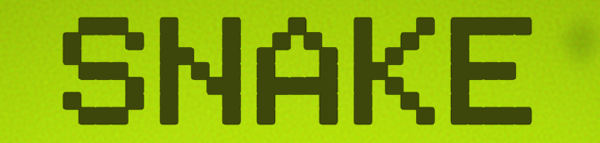
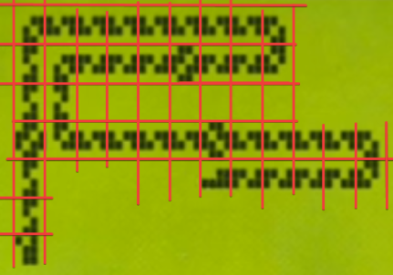
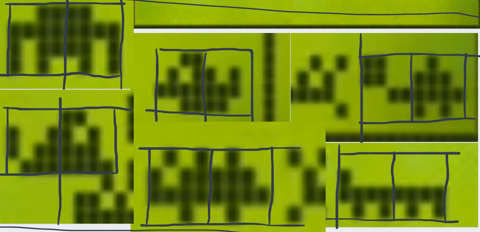

## Playing the Game
The game can be played in three ways. 
- Download the latest windows build [here](https://drive.google.com/open?id=1VnUr0EvaFDb7PW172db-tMZCQt5xGKxP&authuser=nimblefire97%40gmail.com&usp=drive_fs).
- Download the repository with the [link](https://github.com/2nPlusOne/Snake2000/zipball/gh-pages) on the left panel, extract it, and open it up in Unity version 2020.3.4f1 LTS.
- Play a WebGL version [here](https://play.unity.com/mg/other/snake-2000-v0-4) hosted on Unity Play. **Note:** The WebGL build is... strange. The main menu background video does not function properly despite my efforts, the post-processing effects are not tuned correctly, and the input tends to be a bit laggier. To get the intended gameplay experience, follow one of the methods above.

---
---

## Recreating Snake II in Unity

---

### Motivation
This project was born from my desire to see a project through from its inception to a playable, and hopefully fun, finished product. Snake just happened to be the first project idea that came to mind which seemed in-scope. While doing research for this project I decided to reframe the challenge I had set for myself. Rather than create a game that is vaguely 'snake-like', I would instead make my best effort to recreate the visuals and gameplay of a specific entry in the long line of snake games: Snake II, which was bundled with the Nokia 3310 released in late 2000.

---

### Objectives
- See the project through to a playable, entertaining end product
- Mirror the original game's aesthetic, art, and gameplay.
- Use milanote to organize tasks and design docs
- Practice using the command pattern

---

### Recreating the Pixel Art
To recreate the pixel art, I took screenshots of the original gameplay, and sliced up the image (as seen below) to reveal how each segment was constructed. I then recreated each of these segment types as seperate prefab instances in unity using square sprites as pixels. I followed the same procedure to create the pixel art for the snake food and each of the bonus point critter food types. Each grid position in the original game is a 4x4 pixel area, so each prefab was carefully constructed so each pixel lines up properly in it's 4x4 grid area. Each critter took up two grid spaces, so their prefabs have a left and right side.

---

### Implementing the Pixel Art
To implement the pixel art using my new prefabs, I needed a way to know which prefab to show for each segment each frame. Which prefab to use for a given segment depends entirely on the positions of the segment in front, and the segment behind. So all I needed to do was track the direction of each segment, calculated with (nextSegment.position - this.segment.position). After normalizing this direction vector, I now have a reliable way of figuring out which direction any given segment is headed. Wiring up the logic was as simple (and unsightly) as writing conditionals to check the current segment's direction and the previous segments direction, and swap to the appropriate segment art prefab. Unfortunately, this is a very quick and dirty way to do this, and results in lots of code duplication.

Next up was animating snake's head to make it appear as if it is chomping down each bit of food it collects. This involved simply checking if the coordinate in front of the snake head was occupied by food, and if so switch the head prefab to its open mouth variant.

The last step to implementing the original snake graphics was to animate the snake digesting the food, visualized as a bigger segment that starts at the head and passes through the snake to the tail as seen below.

After a few trial and errors, I landed on a working, albiet a bit convoluted approach. Each time the snake head collects food, I add the grid position of the food to a list. Each movement step, each segment checks to see if its own position is in the list, and if so changes its prefab to the digesting variant. Once a given list position passes over the tail, it is removed from the list.

---

### Retro Aesthetic
To align the game more closely to the original aesthetic, I utilized Unity's post-processing stack. Effects I used across the board include vignette, film grain, chromatic abberation, and bloom. While overblown, these effects shift the aesthetic noticeably towards a more retro style. A slight lens distorition effect sells the retro aesthetic even more. It is important not to go overboard with post-process effects, as they can easily become too heavy-handed and distract rather than immerse.

When the player has the game paused, I switch the post-process profile to one including depth of field, which when adjusted properly blurs the game behind the pause UI panel. The same effect is used to blur the background video playing on the main menu.

I made the sound effects by grabbing a royalty-free retro blip, and duplicating it at different pitches in Audacity. I made the game over sound effect using the same technique.

---
---

## Results and Remarks

---

### Gameplay

As of my writing this, the following mechanics from the original game made their way into my project:
- Edge wrapping
- Score counter
- Random food spawns
- Chance to spawn high point food (critter)
- Critter despawn timer

You may notice in the gif above that I also added a mechanic which was _not_ present in the original game: combos. I added this because I felt it added multiple forms of depth to the gameplay experience. The combo system enhances the auditory experience, due to the current combo level affecting the pitch of the eating sound effect. The combo system also changes how the player makes decisions regarding movement. In the original game, the player can take as much time as they like getting from one food to the next, and lends itself to a more casual gameplay experience. With a visible combo timer, the player knows that they will be rewarded for finding the fastest route from one food to the next in the form of a greater score increase.

---

### The Good, the Bad, and the Ugly
**The Good:** I am happy with the final state of this project. The aesthetic is interesting, the gameplay feels rewarding, and I feel I brought something interesting to the genre with the combo bar. Along the way I learned valuable lessons about the command pattern, as well as organizing the project in an OO style.

**The Bad:** I definitely went overboard with the command pattern here. In many places I overzealously added an unnecessary layer of complexity to an otherwise simple architecture. It would have paid off to do a bit more planning to figure out the responsibilities of each of my classes. In a few places I have classes performing tasks which are unrelated to their intended purpose. 

**The Ugly:** Code duplication. Lots of it. I've cleaned up a bit of this in a newer version, which will hopefully be pushed to github by the time you read this. Aside from this, the UI is incredibly fragile. The game border is constructed from many individual square sprites. The UI only functions properly in a 16:9 aspect ratio, so I locked the window to 1920x1080. If I were to change this, I would most likely design the game to take place on a Nokia 3310 screen, and let that be static so the user can resize the game to any size they wish that fits the nokia on-screen.

---

### The Cutting Room Floor
There are many features from the original Snake II that I omitted in my version, and a few extra superfluous ones that I simply never finished (looking at you, leaderboard). However, I feel good about the state of the game, and I think it is time I move on to my next project and carry with me the lessons learned here. I've been reading through Robert Nystrom's _Game Programming Patterns_, and I look foward to designing my next project with these object-oriented patterns in mind.

---
---

### [Return to Portfolio](https://2nplusone.github.io/)
